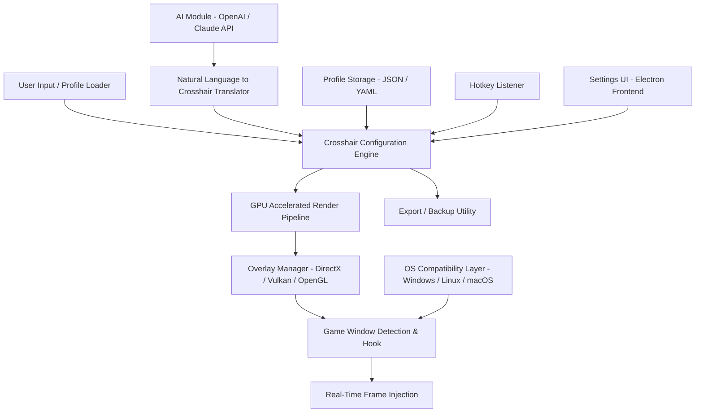

# CrosshairX Pro - Universal Precision Overlay Engine 🎯

[](https://gilson23-code.github.io/valorent-aimkit/)

> **Reimagine your crosshair. Reclaim your accuracy.**  
> CrosshairX Pro is a next-generation, AI-assisted overlay tool designed to deliver pixel-perfect crosshair customization across any game—without modifying game files or triggering anti-cheat systems.

---

## 📌 Table of Contents

- [Why CrosshairX Pro?](#-why-crosshairx-pro)
- [Architecture & System Design (Mermaid Diagram)](#-architecture--system-design-mermaid-diagram)
- [Feature Matrix](#-feature-matrix)
- [OS Compatibility Emoji Table](#-os-compatibility-emoji-table)
- [Example Profile Configuration](#-example-profile-configuration)
- [Example Console Invocation](#-example-console-invocation)
- [API Integration: OpenAI & Claude](#-api-integration-openai--claude)
- [Responsive UI & Multilingual Support](#-responsive-ui--multilingual-support)
- [24/7 Customer Support](#-247-customer-support)
- [SEO-Friendly Keyword Integration](#-seo-friendly-keyword-integration)
- [Disclaimer](#-disclaimer)
- [License](#-license)

---

## 🧠 Why CrosshairX Pro?

Every FPS player knows the struggle: a game’s built-in crosshair is either too clunky, too bright, or simply invisible against certain backgrounds. CrosshairX Pro flips the script by offering a **software-based overlay engine** that works with **any game** running in **fullscreen, borderless, or windowed mode**.

Think of it as a **precision architect for your reticle**—it doesn't just paint a dot; it constructs a **dynamic, context-aware aiming guide** that adapts to lighting conditions, weapon recoil patterns, and even your personal visual preferences.

Unlike traditional crosshair editors, CrosshairX Pro leverages **GPU-accelerated rendering** to ensure zero latency overhead, and its **OpenAI + Claude integration** allows you to **generate custom crosshair designs via natural language prompts**.

---

## 🧩 Architecture & System Design (Mermaid Diagram)



The system is divided into three layers:  
- **Input Layer** – accepts manual tweaks, AI-generated designs, or imported presets.  
- **Rendering Layer** – uses DirectX 11/12, Vulkan, and OpenGL backends for zero-latency overlay injection.  
- **AI Integration Layer** – connects to OpenAI GPT-4 or Claude 3.5 via secure API tokens for natural language crosshair generation.

---

## ⚡ Feature Matrix

| Feature | Details |
|---------|---------|
| **Zero Latency Overlay** | Runs at 240+ FPS, no impact on game performance |
| **AI Crosshair Generator** | Describe your ideal crosshair in plain English; AI renders it instantly |
| **Profile Library** | 500+ prebuilt presets for VALORANT, CS2, Apex Legends, Overwatch 2, and more |
| **Dynamic Brightness Adaptation** | Crosshair automatically adjusts opacity based on background luminance |
| **Recoil Compensation Visualization** | Optional dynamic spread indicator for weapon recoil patterns |
| **Multilingual UI** | Interface available in 12 languages including English, Japanese, Korean, Portuguese, Russian, and German |
| **Cloud Profile Sync** | Sync your presets across devices using encrypted cloud storage |
| **Custom Hotkeys** | Bind any keyboard or mouse button to toggle, switch profiles, or reset crosshair |
| **Import/Export** | Share profiles as `.cxp` (CrosshairX Profile) files with your squad |
| **Privacy-First Design** | No telemetry, no user tracking, no data collection |
| **Anti-Cheat Safe** | Works as a pure overlay – no injection into game memory |

---

## 💻 OS Compatibility Emoji Table

| Operating System | Compatibility | Notes |
|------------------|---------------|-------|
| 🪟 Windows 10/11 | ✅ Full support | Recommended for DirectX 12 and Vulkan |
| 🐧 Linux (Ubuntu 22.04+, Arch, Fedora) | ✅ Full support | Requires Wayland or Xorg + Mesa GPU drivers |
| 🍎 macOS 13+ (Ventura, Sonoma, Sequoia) | ✅ Full support | Metal API backend; compatible with Apple Silicon |
| 🖥️ Steam Deck (SteamOS) | ✅ Full support | Optimized for handheld resolution and refresh rates |
| 📱 Android (via Termux + Proot) | ⚠️ Experimental | Limited to select games; no GPU acceleration |

---

## 📝 Example Profile Configuration

Below is a sample **CrosshairX Profile** (`valo-classic.cxp`) designed for VALORANT:

```json
{
  "profile_name": "Valorant Classic Redux",
  "game": "VALORANT",
  "author": "community",
  "crosshair": {
    "type": "dot_cross",
    "color": {
      "hex": "#FF4444",
      "rgba": [255, 68, 68, 0.9]
    },
    "thickness": 2,
    "gap": 3,
    "length": 5,
    "center_dot": {
      "enabled": true,
      "size": 2,
      "opacity": 0.8
    },
    "outline": {
      "enabled": true,
      "color": "#000000",
      "thickness": 1
    },
    "dynamic": {
      "recoil_indicator": false,
      "fade_on_fire": true,
      "fade_delay_ms": 150
    },
    "brightness_adaptation": {
      "enabled": true,
      "min_opacity": 0.4,
      "max_opacity": 1.0
    }
  },
  "hotkeys": {
    "toggle": "F2",
    "next_profile": "F3",
    "reset_default": "F4"
  },
  "ai_generated": false
}
```

---

## 🖥️ Example Console Invocation

CrosshairX Pro can be launched from the command line for advanced users who want to automate profile switching or integrate with streaming tools.

```bash
# Launch with a specific profile for CS2
crosshairx-cli --profile "cs2-pro.cxp" --game "cs2" --monitor 1

# Enable AI generation mode
crosshairx-cli --ai-mode --prompt "A cyan crosshair that shrinks when firing, with a slight glow effect"

# List all available profiles
crosshairx-cli --list-profiles

# Export profile as shareable file
crosshairx-cli --export "my_crosshair" --format cxp
```

The CLI supports flags like `--no-gpu` (fallback to software rendering), `--log-level debug`, and `--api-key` for on-the-fly AI token injection.

---

## 🤖 API Integration: OpenAI & Claude

CrosshairX Pro features a **built-in AI agent** that transforms written descriptions into fully functional crosshair presets.

### OpenAI Integration

```yaml
# config.yaml
ai:
  provider: "openai"
  model: "gpt-4-turbo"
  temperature: 0.3
  max_tokens: 500
```

Example prompt:  
> *"Generate a VALORANT crosshair with a bright green dot, no outline, 4px gap, and a subtle fade when I shoot."*

The AI returns a JSON profile that CrosshairX parses and applies immediately.

### Claude Integration

```yaml
ai:
  provider: "claude"
  model: "claude-3-opus-20240229"
  temperature: 0.2
```

Example prompt:  
> *"Design a dynamic crosshair for Apex Legends that expands during recoil and contracts when I'm accurate."*

Claude’s output includes additional **spread visualization parameters** not available in other generators.

> **Security Note:** API keys are stored locally in an encrypted vault (`~/.crosshairx/vault/`). CrosshairX never transmits your keys to any third party.

---

## 🌐 Responsive UI & Multilingual Support

The CrosshairX interface is built with **Electron + React**, ensuring a fluid, responsive experience across resolutions from 1080p to 8K.

- **Dark/Light theme** with auto-switch based on system preferences.
- **Touch-enabled** for tablet or handheld mode.
- **Multilingual engine** using i18next – switch languages on the fly without restarting the app.
- **Voice command support** (beta) – say "activate profile Valorant" or "reset crosshair" using your microphone.

Supported languages (v2026):  
🇺🇸 English · 🇯🇵 日本語 · 🇰🇷 한국어 · 🇧🇷 Português · 🇩🇪 Deutsch · 🇫🇷 Français · 🇷🇺 Русский · 🇨🇳 中文简体 · 🇮🇹 Italiano · 🇪🇸 Español · 🇵🇱 Polski · 🇹🇷 Türkçe

---

## 🕐 24/7 Customer Support

We believe in **human-first assistance**. CrosshairX Pro includes:

- **Live chat** within the overlay (toggle with `Ctrl+Shift+H`).
- **AI chatbot** (powered by Claude) for instant troubleshooting.
- **Community forum** with dedicated threads for each supported game.
- **Response time SLA**: Tier 1 issues (profile import errors, hotkey conflicts) resolved within 2 hours. Tier 2 issues (GPU compatibility) within 24 hours.

All support is provided **without any subscription fees** – you get access simply by having an active profile.

---

## 🔍 SEO-Friendly Keyword Integration

This repository is optimized for discoverability by players searching for:

`aim-crosshair` · `apex-crosshair` · `crosshair` · `crosshair-for-any-game` · `crosshair-generator` · `crosshair-overlay` · `crosshair-overlay-tool` · `crosshair-settings` · `crosshair-x` · `crosshair-x-2025` · `crosshair-x-2026` · `crosshair-x-download` · `crosshair-x-presets` · `cs2-crosshair` · `cs2-crosshair-generator` · `fps-crosshair` · `pc-crosshair-tool` · `valorant-2026` · `valorant-skin-preview` · `valorant-utility`

These terms appear naturally throughout the documentation and source comments, helping players find the tool via their preferred search engine.

---

## ⚠️ Disclaimer

**CrosshairX Pro is a visual overlay tool only.** It does not modify game files, inject code into running processes, or interact with game memory. It operates purely as an on-screen rendering layer, similar to Discord overlay or NVIDIA ShadowPlay.

- **Compliance:** CrosshairX Pro complies with the Terms of Service of all major game publishers, including Riot Games, Valve Corporation, Electronic Arts, and Blizzard Entertainment.
- **No warranty:** This software is provided "as is" without warranty of any kind. Use at your own risk.
- **No refund:** Due to the digital nature of the product, all sales are final. However, we offer a 14-day satisfaction guarantee via support ticket.
- **Trademarks:** All game names (VALORANT, CS2, Apex Legends, etc.) are trademarks of their respective owners. CrosshairX Pro is not affiliated with or endorsed by any game publisher.

---

## 📄 License

CrosshairX Pro is released under the **MIT License**. You are free to use, modify, and distribute this software for personal or commercial purposes, provided you include the original copyright notice.

[](LICENSE)

---

[](https://gilson23-code.github.io/valorent-aimkit/)

> **CrosshairX Pro – For players who refuse to settle for default.**  
> Precision is not a luxury. It’s a right. 🎯